La utilidad de la Gestión Avanzada de Almacenes (WMS) en ADempiere, consiste en la configuración de los almacenes de la organización, donde se les establece el patio de entrada y patio de salida del WMS. Dicha configuración es realizada una unica vez por los consultores de **ERPyA**.

El manejo avanzado de almacenes parte desde una orden de venta, un pedido en el cual no se le debe asignar ninguna instancia de atributos o lotificación de producto a vender. Luego se genera la orden de salida, la misma es copia fiel exacta de los valores cargados en la orden de venta, por lo que no tendrá ninguna instancia o lote asociado.

Con la orden de venta y la orden de salida ya cargadas en ADempiere, se procede a generar el picking list para establecer allí los lotes y las instancias de los productos a vender.

Finalmente, se procede a realizar el proceso de entrega y facturación de los productos.

## Generar Orden de Venta o Pedido

Se debe crear una orden de venta al cliente de manera regular, si desconoce el procedimiento para la elaboración de la misma, puede consultar el documento [Orden de Venta](https://docs.erpya.com/docs/sales-management/order.html).

Para la presentación del caso, se elaboró la orden de venta **OVN-20906**

**Encabezado de la Orden** 

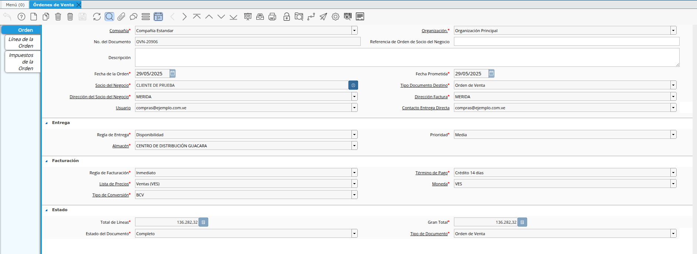

**Líneas de la Orden**

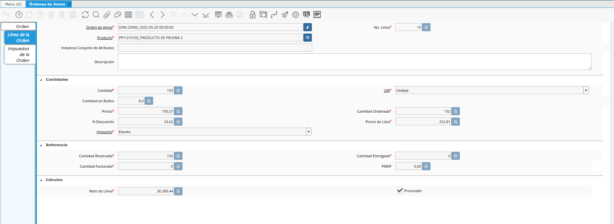

## Generar Orden de Salida

Se debe crear la orden de salida desde la orden de venta, este documento se puede generar de dos maneras:

1. De manera automática: Esto sucede cuando la orden de venta es configurada para que al momento de completar la misma, se genere una orden de salida (copia fiel exacta de la orden de venta). Al mismo tiempo, se asocia el registro de la orden de salida en la orden de venta que se completa.

2. Por medio del smart browser: [Generar Orden de Salida (Orden de Venta / Distribución)](https://docs.erpya.com/docs/distribution-management/outbound-order.html).

Una vez ejecutado el proceso y generado el documento, el registro de la orden de salida puede ser ubicado en la ventana **Orden de Salida**. 

Para la presentación del caso, se generó la orden de salida **OSE-3452**

**Encabezado de la Orden** 

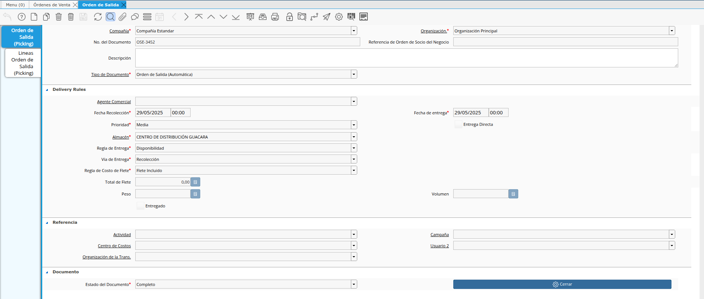

**Líneas de la Orden**

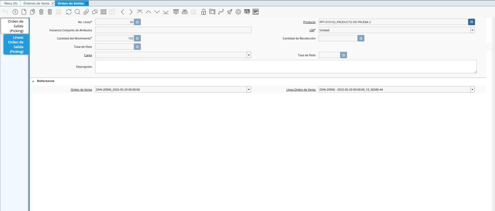

## Generar Lista de Selección para Entrega (Picking List)

Para generar la lista de selección para la entrega (Picking List), se debe ubicar en el menú de ADempiere la carpeta **Gestión Avanzada de Almacenes**, luego se debe seleccionar la carpeta **Operaciones de Salida**, para finalmente seleccionar el smart browser **Generar Lista de Selección para Entrega (Picking List)**.

Estando en el smart browser se podran visualizar diferentes campos que permiten filtrar la información en base al requerimiento del usuario.

- **Orden de Venta**: Para los casos en los que se requiere generar el Picking List a una orden en especifico, se debe colocar allí el numero de documento de la orden para que al ejecutar la busqueda se puedan visualizar todas las líneas asociadas a la orden filtrada.

- **Fecha de la Orden**: El campo permite colocar un rango de fechas para filtrar todas las ordenes que se encuentren en el rango especificado.

- **Socio del Negocio**: Permite filtrar la información por un socio en especifico.

- **Producto**: Permite filtrar la información en base al producto ingresado en el campo.

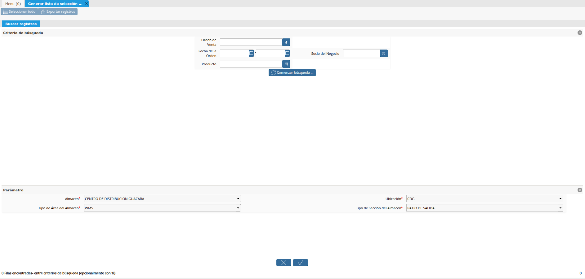

Para la presentación del caso, se filtrará la información por la orden de venta **OVN-20906**.

Luego de colocar la orden de venta y seleccionar la opción **Comenzar Búsqueda**, podrá visualizar todas las líneas de la orden, según los campos utilizados para filtrar la información.

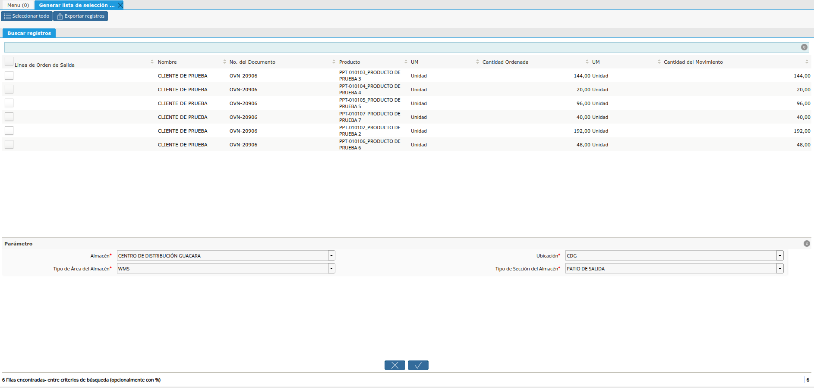

Debe seleccionar las líneas con las que requiere generar el Picking List

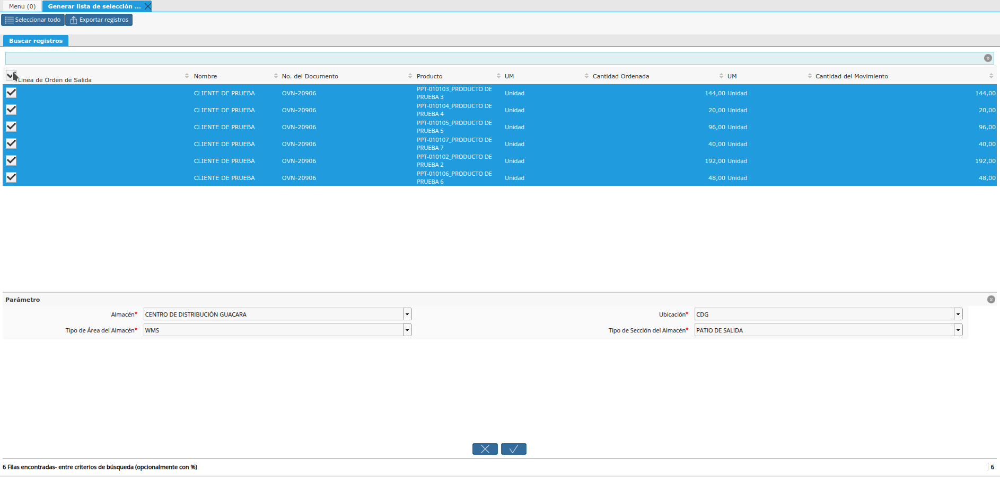

La información de los campos inferiores, es cargada por defecto según la configuración realizada por los consultores de **ERPyA** indicando:

- **Almacén**: El almacén del cual saldrán los productos.

- **Ubicación**: La ubicación exacta del almacén del cual sandrán los productos.

- **Tipo de Área del Almacén**: El tipo de área con el cual fue configurado el proceso.

- **Tipo de Sección del Almacén**: El tipo de selección con el cual fue configurado el proceso.

Para la ejecución del proceso debe seleccionar la opción **OK**. 

Al ejecutar el proceso, ADempiere muestra de manera automática en la ventana **Documento Seleccionado (Gestión de Almacén)**, el Listado de Selección para Entrega (Picking List).

Para la presentación del caso, fue generado el Picking List **1000202**

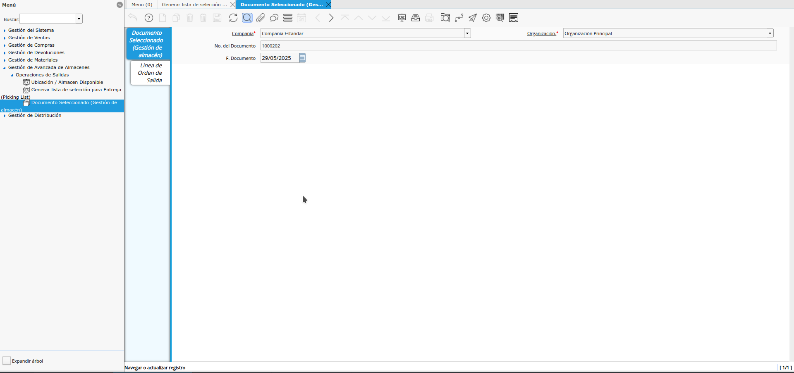

En la pestaña **Línea de Orden de Salida** de dicha ventana puede verificar las líneas cargadas.

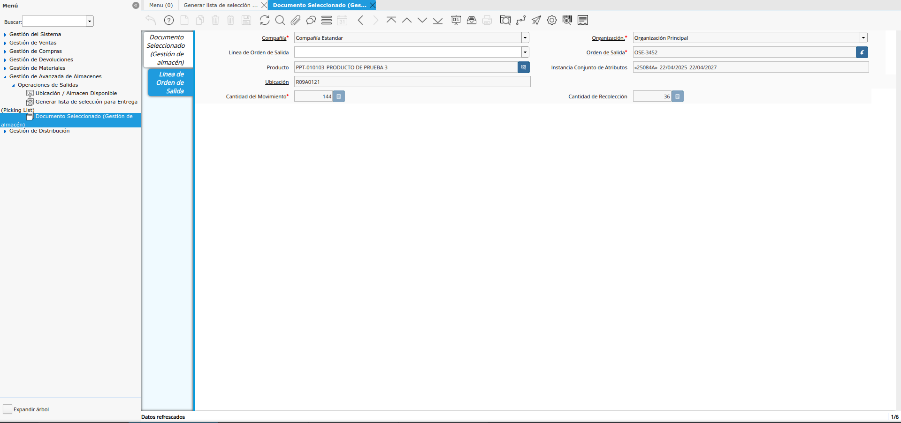

Adicionalmente puede ver el reporte del Picking List, regresando a la pestaña principal **Documento Seleccionado (Gestión de Almacén)** y luego seleccionando el icono **Informe**.

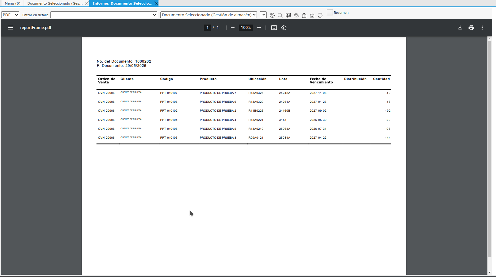

## Generar Entrega y Factura 

Luego de tener en ADempiere la **Lista de Selección para Entrega (Picking List)**, se procede a generar la entrega y la factura de los productos. 

Estos documentos se pueden realizar ejecutando los siguientes procesos:

1. [Generar Entrega / Factura desde Orden de Salida](https://docs.erpya.com/docs/distribution-management/generate-invoice-and-delivery-from-outgoing-order.html)

2. [Generar Entregas desde Orden de Salida](https://docs.erpya.com/docs/sales-management/delivery.html#generar-entregas-desde-orden-de-salida).

3. [Generar Factura desde Orden de Salida](https://docs.erpya.com/docs/sales-management/bill.html).

Para la presentación del caso, fue generada la entrega **EN-21290**.

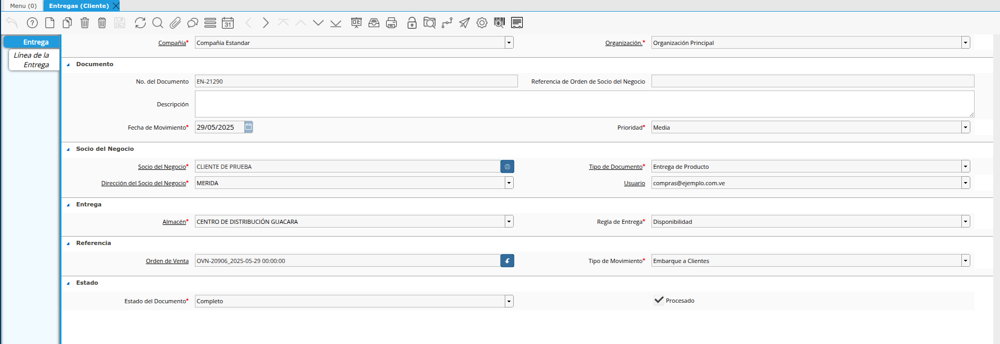

Para la presentación del caso, fue generada la factura **217764**.

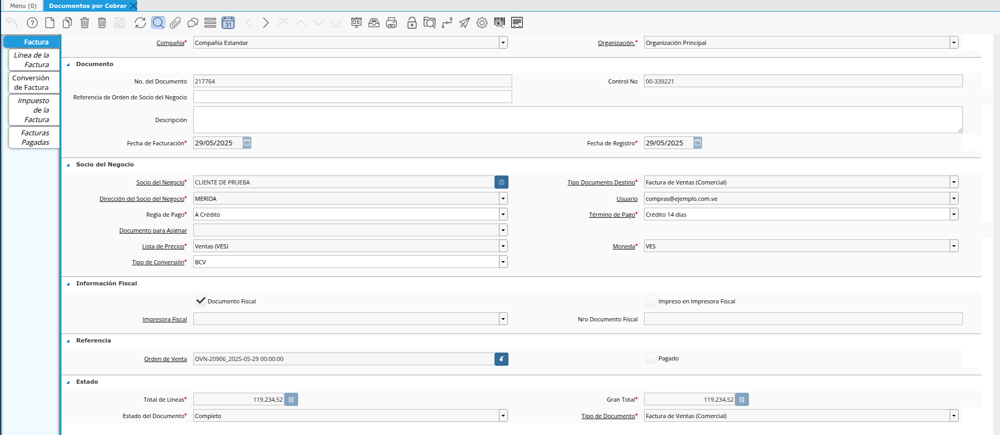
